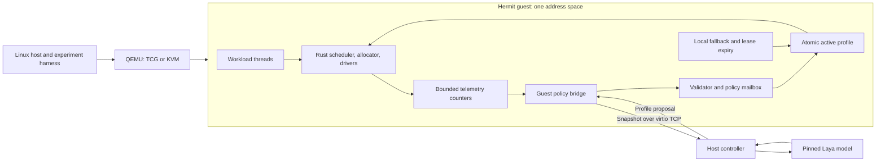
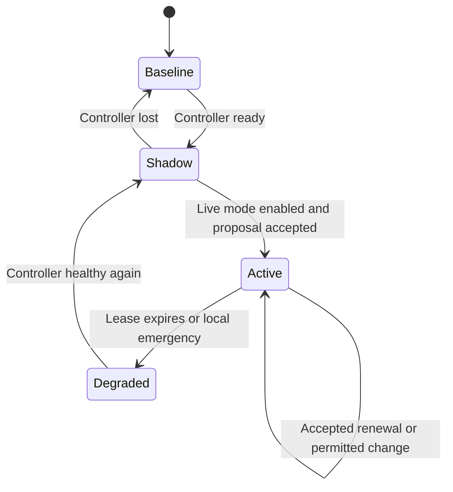

# System architecture

## Placement and responsibility

The first implementation is a **supervisory controller** around a Rust execution core. The policy controller runs at a much slower frequency than the scheduler. Each accepted decision installs a small, complete resource profile; normal execution then consults local state.

The arrows are logical data flow, not permission for the host model to write guest memory. Only the guest validator and scheduler owner may activate a profile. The controller cannot issue arbitrary Rust code, addresses, register writes, function names, or shell commands.

| Component | Owns | Must not depend on |
| --- | --- | --- |
| Hermit mechanisms | Interrupts, timers, task state, virtual memory, devices, synchronization | A live model or controller connection |
| Policy core | Profile validation, hard limits, leases, local fallback, generation counters | Python, floating-point inference, network I/O |
| Guest bridge | Snapshot serialization, bounded transport, staging proposals | Holding a scheduler/allocator lock during I/O |
| Host controller | Feature preparation, Laya inference, calibration, abstention | Direct kernel-memory access |
| Harness | VM lifecycle, model artifacts, workloads, logging, comparison | Treating controller logs as proof of kernel activation |

## What “freestanding” means here

The guest application can use supported Rust `std` facilities while targeting Hermit; the resulting image boots without a Linux guest. The kernel itself uses its appropriate low-level Rust environment. Using `std` in the guest bridge does not mean there is a hidden Linux process underneath it. Rust documents Hermit targets as unikernel targets. [Rust target documentation](https://doc.rust-lang.org/rustc/platform-support/hermit.html).

The separate Laya service is a Linux application in the first architecture. It may be a native process or container. A container packages dependencies but does not make the whole system independent of Linux. In a second deployment it could run in a companion Linux VM. Moving it into the Hermit image requires the portability work in [document 13](13-in-guest-evolution.md).

## Boot and initialization

1. The harness records the artifact manifest and gives this VM launch a fresh random boot identifier.
2. The Hermit loader enters the guest; architecture initialization, memory setup, interrupts, and device initialization proceed normally.
3. The kernel installs the built-in balanced profile and initializes counters, fixed-capacity mailboxes, resource reservations, and the policy lease timer.
4. Trusted guest startup registers workload classes and creates the bridge and benchmark threads. Registration closes before workloads begin.
5. The bridge attempts a connection. Workloads run even if the controller is absent, loading weights, or reporting an error.
6. The controller loads one pinned checkpoint, completes a warm-up and self-test, and exchanges a version/capability handshake.
7. The guest begins shadow evaluation. An explicit experiment configuration enables live application after the relevant validation gate.

No boot stage fetches model weights. No model response supplies bootstrap addresses, stack limits, class privileges, or hardware configuration.

## Timing model

These are **initial design values**, subject to calibration on the actual platform:

| Quantity | Initial value | Meaning |
| --- | --- | --- |
| Scheduler quantum target | 2 ms | Maximum intended ordinary workload slice; confirm timer integration |
| Accounting/replenishment interval | 100 ms | System reservation and service accounting |
| Snapshot and decision interval | 1,000 ms | One pending model request per guest |
| End-to-end acceptance deadline | 750 ms | Guest-measured age from snapshot capture through policy activation |
| Profile lease | 3,000 ms from snapshot capture | Includes queue, inference, transport, and staging time |
| Minimum ordinary profile dwell | 2,000 ms | Prevent oscillation; identical-profile renewals are allowed |
| Local expiry check | Every scheduling entry and a timer at expiry | Prevent dependence on the bridge waking up |

For example, a reply arriving 600 ms after capture has at most 2,400 ms left on its lease. It does not get a new three-second lifetime on receipt. Reject a proposal if activation cannot occur before the acceptance deadline. Use guest monotonic time for validity, never host wall-clock synchronization.

The initial interval is justified only if measured p99 inference plus serialization, transport, and apply delay fits the deadline with headroom. A slower CPU can use a separately declared two- or five-second experiment configuration with correspondingly slower workloads. Record that as a different experiment; do not silently loosen timeouts until an overloaded model appears healthy.

The host cannot directly compare its clock to `accept_until_guest_us`. It starts a conservative local timer on request receipt, uses the advertised duration only as an upper bound, and promptly discards locally expired work. Only the guest's checks establish acceptance. VM suspension or host descheduling may consume guest-visible elapsed time; after resume, check expiry before resuming model policy. Do not claim wall-clock recovery while the VM itself is stopped.

## Operation and recovery

In shadow mode, the bridge records a hypothetical decision but never stages it for activation. In active mode, a missed request does not immediately discard an unexpired profile. The guest rejects that request and continues the existing profile until its lease expires. Expiry selects the local fallback at the next bounded scheduling opportunity and discards staged stale work.

A memory emergency may invoke deterministic admission reduction and safe cache reclamation immediately, regardless of the active model profile or minimum dwell. It cannot revoke arbitrary live memory. An operator's live-mode disable also takes effect independently of inference. Recovery requires a fresh handshake and two consecutive valid shadow decisions before returning to active mode; the experiment configuration may require manual rearming for debugging.

The local fallback is not “keep the last model output forever.” It is the balanced profile plus independently enforced resource limits and pressure handling. If the guest panics, the outside harness records a failure and may restart the VM. That external restart is recovery from a kernel failure, not proof that the guest's internal fallback worked.

## Progress dependencies

The control bridge needs CPU time, memory, timers, and network buffers. It cannot share an exhaustible pool with all workload allocations. Reserve its stack, receive buffer, mailbox, and snapshot buffer during startup. Reserve bounded CPU service for essential system/control work, and exempt its connection from experimental workload throttling.

Even the reservation cannot repair an infinite interrupt-disabled section, corrupt scheduler, dead device, or stopped VM. State the liveness assumptions explicitly: the vCPU runs, timer interrupts are serviced, the kernel is not corrupt, and bounded code eventually returns. QEMU fault tests assess these assumptions; they do not create a hard real-time proof.

## Trust boundary

Within the normal unikernel, Rust modules and threads are organizational boundaries, not hardware-enforced process isolation. Trusted workload code can share memory with the kernel; unsafe code and DMA remain part of the trusted computing base. Do not load hostile plugins and claim that a validator isolates them.

The model is untrusted for decision quality. Even an authenticated controller can choose the worst allowed profile. The guest must therefore enforce invariants independently of confidence or model identity. The host, QEMU, and local harness are trusted for this experiment; hostile-host security is outside its claim.

Use telemetry counts, normalized measurements, and enumerated workload classes. Avoid arbitrary request text, secrets, memory dumps, and free-form model instructions supplied by workloads. Authentication addresses peer identity; input restriction and enforcement address bad decisions. They solve different problems.

## Expansion order

Prove one-core CPU scheduling first. Add memory-pool targets and admission through a joint profile only after each deterministic actuator passes its tests. Add SMP by introducing per-core ownership, acknowledgments, and coordinated generations; never treat `-smp 4` as sufficient implementation. Add an in-guest runtime only after the external architecture produces useful results.
