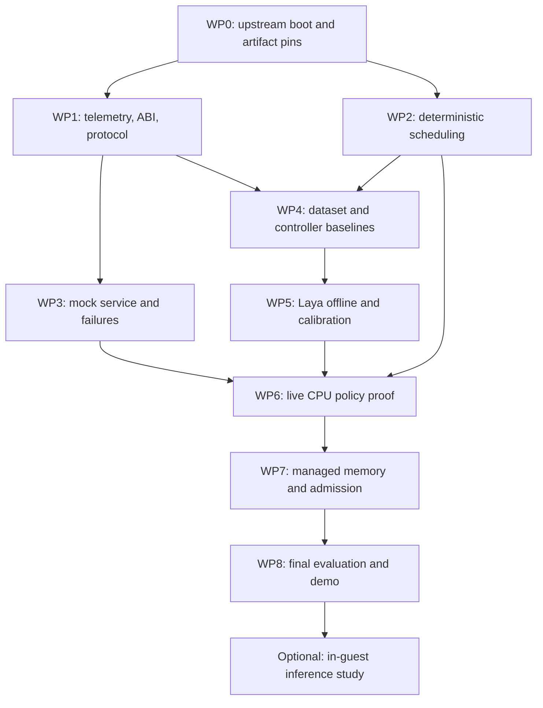

# Delivery roadmap and work packages

## Planning envelope

Assume a kernel/Rust engineer, an ML engineer, and an infrastructure/test engineer, with architecture review shared among them. For a team familiar with low-level Rust, budget approximately **12 weeks plus 2–4 weeks contingency for S4 qualification**. The minimum S3 demonstration may be reachable around weeks 6–8 if upstream compatibility and scheduler work proceed well. These are estimates, not delivery promises.

A single engineer should schedule the work serially and allow substantially more time. In-guest inference is excluded from this estimate. The critical path is boot compatibility → deterministic scheduler correctness → live actuation → held-out qualification, not model downloading.

## Dependencies

Telemetry and model tooling can develop alongside scheduler work, but causal action labels need working deterministic actuators. Training on invented telemetry while the real metrics remain undefined is not a substitute.

## Work packages

| ID / suggested window | Owner | Deliverable and acceptance |
| --- | --- | --- |
| WP0 / week 1 | Infrastructure + kernel | Pin source/toolchains/loader; boot untouched template in TCG; decode success/failure; record G0 manifest |
| WP1 / weeks 2–3 | Kernel | Class registration, counters, versioned ABI, bounded snapshots, baseline resource reservations; ordinary guest progress independent of controller |
| WP2 / weeks 2–5 | Kernel | Host scheduler model, timer/accounting integration, opt-in fair scheduler, immutable CPU catalog, expiry and fallback; pass G2 |
| WP3 / weeks 2–4 | Infrastructure | Authenticated bounded protocol, mock server, activation traces, timeout/reconnect/fault harness; pass G1 and relevant failure tests |
| WP4 / weeks 3–6 | ML + infrastructure | Fixed-profile sweeps, tuned heuristic, workload splits, branch labeling prototype, explicit experiment objectives |
| WP5 / weeks 4–6 | ML | Pinned Laya adapter; zero-shot report; timing profile; calibration; optional adaptation only if justified; G3 evidence |
| WP6 / weeks 6–8 | Entire team | Shadow then active Laya CPU decisions; actual scheduler effects; controller-kill recovery; S3/G4 demonstration |
| WP7 / weeks 8–10 | Kernel + ML | Tagged fallible pools, safe eviction, bounded admission, joint catalog, deterministic tests, new labels/calibration; G5 |
| WP8 / weeks 10–12 | Test lead + reviewers | Held-out paired runs, fault/soak qualification, cost report, replay package, S4 verdict, demo; G6 |

Weeks overlap because owners can work on independent components. If WP2 slips, don't convert an application-only demonstration into an S3 claim to preserve the date.

## Ticket-sized implementation breakdown

### WP0: reproducible foundation

- Inventory host capabilities and package/toolchain gaps; produce a doctor report.
- Reproduce template lane A without policy code.
- Reproduce candidate development lane B and verify its nested kernel/loader toolchains.
- Build successful and deliberately failing smoke images; test exit-code decoding and timeout cleanup.
- Capture a clean source/artifact manifest and freeze a known-working QEMU machine/CPU configuration.

Exit evidence: serial logs, checksums, commands, compiler versions, accelerator mode, expected exit statuses. Stop model integration if the original baseline cannot boot.

### WP1–WP3: mechanisms and contract

- Define fixed-capacity structures and unit conventions; establish ABI layout fixtures.
- Implement frozen class registration, task generation IDs, and telemetry counters.
- Implement scheduler reference model and adversarial service-accounting tests.
- Integrate queue transitions and timer preemption with Hermit; preserve a feature-disabled baseline.
- Implement profile catalog, staging mailbox, local expiry, emergency generation rules, and acknowledgment ring.
- Implement protocol framing, authentication, cross-language fixtures, and parser rejection tests.
- Implement mock controller and guest transport worker without locks held during I/O.
- Add process supervision, event correlation, controller absence/kill/hang tests, and artifact capture.

Exit evidence: all deterministic profiles affect actual scheduling; no inference needed for progress; failure matrix passes under TCG, with timing checks separately on KVM.

### WP4–WP6: Laya evaluation and activation

- Define the open-loop workload generator and split manifests.
- Measure fixed-profile effects and the deterministic adaptive baseline.
- Collect bounded raw telemetry and verify token budgets for the selected checkpoint.
- Implement pinned SDK loading, warm-up, backend reporting, bounded inference queue, and abstention.
- Evaluate zero-shot choices, train if justified, and calibrate on independent data.
- Run shadow mode and inspect disagreement with measured outcomes.
- Activate live CPU-only catalog in fresh QEMU trials; correlate all decision and kernel events.
- Demonstrate controller loss and recovery with continued kernel service.

Exit evidence: live S3 causal trace, model-quality report including weaknesses, qualified end-to-end deadline, and reproducible artifact bundle.

### WP7–WP8: broader policy and final handoff

- Add tagged arenas and safe cache eviction with ownership tests.
- Add admission accounting, queued-byte limits, and drain-on-limit-reduction behavior.
- Freeze a joint catalog; regenerate training/calibration data for that action space.
- Validate desired versus actual resource convergence.
- Run held-out trials, per-scenario reports, cost accounting, and soak/fault qualification.
- Package demo instructions, exact artifacts, trace viewer/report, and reviewer sign-off.

Exit evidence: engineering verdict and research verdict separately stated, with all limitations attached to the relevant claims.

## Stop/go decisions

| Trigger | Required response |
| --- | --- |
| No compatible upstream build after a time-boxed 3–5 day investigation | Choose another explicitly pinned upstream pair and document the compatibility issue |
| Scheduler cannot preserve progress under allowed profiles | Continue deterministic mechanism work; do not activate Laya |
| Laya exceeds decision deadline | Measure a slower declared control interval or a justified alternate backend; reconsider workload timescale |
| Profiles are not meaningfully distinguishable | Improve the actuator/workload experiment before training |
| Zero-shot Laya is poor | Evaluate targeted adaptation and a simple classifier; preserve zero-shot result |
| Laya loses to the tuned heuristic after adaptation | Report negative policy-quality result; decide whether to keep it only as an architecture demonstration |
| In-guest port dominates remaining effort | Keep S4 as the deliverable and schedule the port as a separate project |

## Review checkpoints

At the end of weeks 1, 5, 8, and 12, review tangible artifacts: a boot log; a scheduler service trace and fault report; a live AI actuation/recovery trace; and a held-out evaluation package. Reviewers should be able to reproduce each checkpoint without relying on an engineer narrating what happened.

The implementation branch should never label a milestone complete merely because all its source files exist. Each work package exits on the evidence above.
